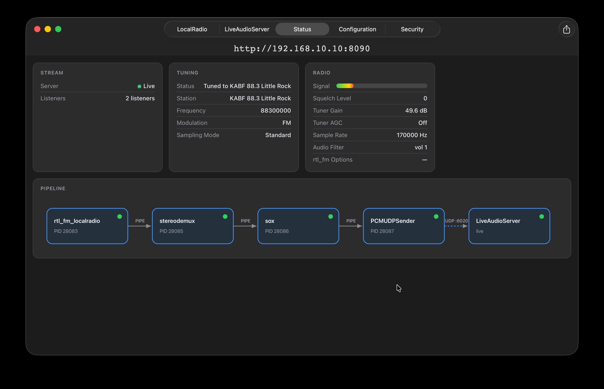

AntennaHead Pipeline Tools
==========================

A **Custom Task** runs a chain of executables piped left to right: each stage's `stdout` feeds the next stage's `stdin`. AntennaHead automatically appends two stages to the end of every custom task:

1.  **sox** — resamples the last stage's output (described by the task's _Sample Rate_ and _Channels_ fields) to 48000 Hz, 2-channel S16LE, and
2.  **PCMUDPSender** — sends that PCM over UDP to the always-running LiveAudioServer, which streams it to listeners.

So a custom task only needs to produce **raw signed 16-bit little-endian PCM** ("S16LE") at a constant rate/channel count, and set the task's Sample Rate and Channels fields to match its final stage.

Conventions
-----------

*   **Tool names:** picking a tool from the pop-up stores its bare name; AntennaHead resolves it to the bundled helper (or a known system tool) when the pipeline starts. A _Custom path…_ may point anywhere, but the App Sandbox can deny launching some external binaries — the UDP bridge below is the workaround.
*   **Arguments:** one argument per row, passed literally — no shell, no quoting. A flag and its value are _two rows_ (`--port`, then `6030`). Text with spaces is fine in a single row.
*   **Use straight dashes:** options start with two hyphens (`--repeat`). If a tool reports an unknown argument that looks right, check for a smart em dash (—) from autocorrect in an older record.
*   **`--exit-with-parent`:** all AntennaHead helpers accept this flag; it makes the helper exit if the app dies unexpectedly, so pipelines never orphan. Recommended on the _first_ stage.

AntennaHead helpers
-------------------

### PCMSpeechSynth — text-to-speech source

Renders text to speech (S16LE mono at `--rate`) and writes it to stdout, paced in real time.

Option

Description

`--text <string>`

Speak this text (one argument row; spaces OK, no quotes needed).

`--input stdin`

Read the text from stdin (to end-of-file).

`--input file:<path>`

Read the text from a file.

`--input udp:<port>`

Wait for text datagrams; each one replaces the current text (send with `nc -u`).

`--rate <hz>`

Output sample rate, 8000–48000. Default 22050. Set the task's Sample Rate to match, Channels to 1.

`--voice <id-or-language>`

Voice identifier or language code (e.g. `en-US`).

`--speech-rate <0..1>`

Speaking speed. Default: system default.

`--ssml`

Parse the text as SSML markup for prosody control, e.g. `<speak>hello <break time="500ms"/> <prosody pitch="+40%">there</prosody></speak>`.

`--repeat`

Loop the audio continuously.

`--gap <seconds>`

Silence between repeats. Default 1.0.

`--list-voices`

Print available voices and exit.

`--exit-with-parent`

Exit if the app dies.

Two routes to prosody control (pitch, pauses, emphasis): the classic voices (identifiers starting `com.apple.speech.synthesis.voice.` — Fred, Alex, …) honor Apple's embedded speech commands in plain text, e.g. `[[pmod 60]]`, `[[pbas 40]]`, `[[slnc 500]]`, `[[rate 120]]`. The modern voices (Samantha, Siri) _read those aloud_ instead — use `--ssml` with them. Don't mix the two syntaxes.

### PCMMixer — mix two or more PCM streams

Mixes S16LE inputs sample-wise (with saturation) into one output. All inputs must share the same rate and channel count. **Input 0 is the clock master** — it paces the output; other inputs are buffered and contribute silence when they under-run, so a stalled source can't freeze the pipeline.

Option

Description

`--input stdin` / `--input udp:<port>`

Repeatable; two or more inputs, at most one stdin.

`--output udp:<host>:<port>`

Send output over UDP instead of stdout.

`--control-port <n>`

UDP port for live mix control (see below).

`--gain <i>=<g>`

Initial gain for input _i_ (repeatable; >1 amplifies).

`--ratio <0..1>`

Initial crossfade for inputs 0/1 (gain₀ = 1−r, gain₁ = r).

`--exit-with-parent`

Exit if the app dies.

Control commands (one line per UDP datagram, e.g. `echo "ratio 0.25" | nc -u -w1 127.0.0.1 6031`):

Command

Effect

`ratio <0..1>`

Crossfade inputs 0/1.

`gain <i> <g>`

Set input _i_'s gain.

`gains`

Reply to the sender with the current gain list.

### PCMUDPReceiver — UDP → stdout source

Listens for UDP datagrams and writes their payloads to stdout. This is the bridge for external tools that can't be bundled (code signing): run them outside AntennaHead and have them send PCM to a loopback port.

Option

Description

`--port <n>`

UDP port to listen on. Required.

`--bind <addr>`

Listen address. Default 127.0.0.1 (loopback only); use 0.0.0.0 for LAN senders.

`--exit-with-parent`

Exit if the app dies.

### PCMUDPSender — stdin → UDP sink

Sends stdin as UDP datagrams (max 2048 bytes each). AntennaHead appends this automatically as every pipeline's final stage, but it can also be used mid-task to feed a PCMMixer input or another machine.

Option

Description

`--port <n>`

Destination UDP port. Required.

`--host <addr>`

Destination address. Default 127.0.0.1.

`--exit-with-parent`

Exit if the app dies.

### AudioInputCapture — Core Audio device source

Captures a Core Audio input device (microphone, line-in, loopback drivers) and writes S16LE PCM to stdout.

Option

Description

`--device-name <name>`

Input device name, e.g. `MacBook Pro Microphone`. Required.

`--rate <hz>`

Output sample rate. Default 48000.

`--channels <n>`

Output channels. Default 2.

`--exit-with-parent`

Exit if the app dies.

### AUProcessor — Audio Unit effect stage

Runs stdin → stdout through one installed Audio Unit effect (Apple's built-ins like `AUGraphicEQ`, `AUDynamicsProcessor`, `AUMatrixReverb`, or third-party plugins) — no audio device, no plugin window. Frame counts pass through 1:1, so it slots anywhere a sox effect would. Instead of the plugin's GUI, set parameters with `--param`, load a `.aupreset` saved from GarageBand/Logic/AU Lab, or adjust live over the control port.

Option

Description

`--unit <spec>`

The effect: a name (`AUGraphicEQ`) or the codes from `--list-units` (`aufx:greq:appl`). Required.

`--rate <hz>`

Stream sample rate. Default 48000 — must match the neighboring stages.

`--channels <n>`

Stream channels. Default 2 — must match the neighboring stages.

`--param <name>=<value>`

Set a parameter by its name from `--list-params` (repeatable; values clamp to the published range). Spaces in names may be written as underscores — `Delay_Time=0.4` — which survives any argument splitting.

`--preset <path>`

Load a `.aupreset` file — the headless route to settings made in the plugin's real GUI.

`--factory-preset <index>`

Select a built-in preset (indexes in `--list-params`).

`--control-port <n>`

UDP port for live control (see below).

`--out-of-process`

Host the AU in a system extension process — for third-party v2 plugins that won't load in-process.

`--list-units`

Print installed effect units and exit.

`--list-params`

Print the chosen unit's parameters and factory presets, then exit.

`--exit-with-parent`

Exit if the app dies.

Control commands (one line per UDP datagram):

Command

Effect

`param <name> <value>`

Set a parameter (the name may contain spaces; the last word is the value).

`params`

Reply to the sender with all current values.

`bypass on|off`

Toggle the effect's bypass.

`preset <path>`

Load a `.aupreset` file.

### PCMPassthrough — no-op stage

Copies stdin to stdout unchanged; takes no options. Useful as a placeholder, and its source is the template for writing new DSP stages.

Bundled third-party tools
-------------------------

### rtl\_fm\_localradio — RTL-SDR tuner/demodulator

LocalRadio's fork of rtl\_fm. Reads the RTL-SDR USB dongle and demodulates to S16LE mono on stdout. Commonly used flags (see the sample tasks for full command lines):

Flag

Description

`-f <hz>`

Frequency in Hz. Repeatable for scanning.

`-M <mode>`

Modulation: `fm`, `am`, `usb`, `lsb`, `raw`.

`-s <hz>`

Output sample rate (set the task's Sample Rate to match, unless a later stage resamples).

`-g <db>`

Tuner gain (e.g. 49.6).

`-l <level>`

Squelch level (0 = off).

`-o <n>`

Oversampling.

`-F <size>` / `-A <math>`

FIR filter size / atan math (`std`, `fast`, `lut`).

`-p <ppm>`

Frequency correction.

`-c <port>`

Send the status feed (frequency, RMS level) to this UDP port — use the Status Port shown on the Configuration tab to drive the app's signal meter.

`-E <option>`

Extra options, repeatable (e.g. `pad`, `direct` for direct sampling, `dc`).

`-d <index>`

Dongle selection when more than one is attached.

### sox — resampler / filter

General audio processor. For raw-PCM pipeline use, both sides must be described explicitly. The canonical mid-pipeline resample looks like:

    sox -V2 -q
        -r <in rate> -e signed-integer -b 16 -c <in ch> -t raw -
        -e signed-integer -b 16 -c <out ch> -t raw -
        rate <out rate> vol 1 dither -s

(each token is one argument row; the two lone `-` arguments mean stdin/stdout). Effects like `vol`, `deemph`, `highpass` follow at the end. Note the task's automatic final resample already handles the last-stage conversion to 48 kHz stereo.

### stereodemux — FM stereo decoder

Decodes an FM multiplex (MPX) signal into stereo L/R. As used by AntennaHead's own FM pipeline: input is rtl\_fm's raw output at the tuned rate, `-r <rate>` tells it that input rate, and it emits 2-channel S16LE (set the following sox stage — or the task's Channels field — to 2).

### nc — system netcat

macOS's built-in netcat, resolved from `/usr/bin/nc`. Handy for simple TCP/UDP plumbing, e.g. receiving gqrx's UDP audio: `nc` with arguments `-l`, `-u`, `localhost`, `7355`. For UDP sources, note that nc latches onto the first sender; PCMUDPReceiver is usually the better choice.

Example pipelines
-----------------

### Looping spoken announcement

Task Sample Rate 22050, Channels 1. One stage:

    PCMSpeechSynth  --text | AntennaHead test loop | --repeat | --gap | 5 | --exit-with-parent

(the `|` above separates argument rows).

### Spoken announcement with an echo effect

The same repeating announcement, run through Apple's AUDelay unit for an echo. Task Sample Rate 22050, Channels 1. Two stages:

    PCMSpeechSynth  --text | AntennaHead test loop | --repeat | --gap | 5 | --exit-with-parent

    AUProcessor  --unit | AUDelay | --rate | 22050 | --channels | 1 | --param | Delay_Time=0.4 | --param | Dry/Wet_Mix=35 | --param | Feedback=40

Note the AUProcessor stage's `--rate` and `--channels` match the speech stage's output (22050 Hz mono) — the task's automatic final stage still resamples to 48 kHz stereo. A longer `Delay Time` spaces the echoes out; more `Feedback` makes them repeat longer; `Dry/Wet Mix` sets how loud they are (100 = echo only).

### External nrsc5 (HD Radio) over the UDP bridge

Outside AntennaHead: `nrsc5 -o - 89.1 0 | ffmpeg/sox … | PCMUDPSender --port 6030` (or have the tool send UDP itself). Task Sample Rate 44100, Channels 2. One stage:

    PCMUDPReceiver  --port | 6030 | --exit-with-parent

### EQ / compression on any audio stage

Insert between any two stages (here: boosting lows and taming peaks after a device capture, with live control on UDP 6040):

    AUProcessor  --unit | AUGraphicEQ | --param | 100.0_Hz=6 | --param | 8000.0_Hz=-3 | --control-port | 6040 | --exit-with-parent

Adjust live: `echo "param 100.0 Hz 2" | nc -u -w1 127.0.0.1 6040`. Run `AUProcessor --list-params --unit AUGraphicEQ` in Terminal (inside the app bundle's `Contents/Helpers`) to see each unit's parameter names.

### Radio with a speech ducked underneath

Stage 1 mixes the radio (stdin isn't available in stage 1, so both come in by UDP): run the radio task's audio into UDP 6032 and speech into UDP 6033 (each via `PCMUDPSender`), then a task whose single stage is:

    PCMMixer  --input | udp:6032 | --input | udp:6033 | --control-port | 6031 | --ratio | 0.2 | --exit-with-parent

Adjust the blend live: `echo "ratio 0.5" | nc -u -w1 127.0.0.1 6031`.

**Port picking:** avoid the ports AntennaHead already uses (see the Configuration tab — by default 8090/8094 web, 8080/8443 streaming, 6020 audio UDP, 6021 status UDP). Loopback UDP has no backpressure: source stages that generate faster than real time (files, speech) should pace themselves, as PCMSpeechSynth does.
